# Perceptrum capacity execution paths

This graph is the traceability map consumed by workload contract `perceptrum-workload/1.0.0`. File-level integrity is recorded in `perceptrum-source-inventory.json`.

```mermaid
flowchart LR
  Camera[RTSP camera] --> Url[URL fallback and TCP reconnect]
  Url --> FFmpeg[FFmpeg receive and continuous decode]
  FFmpeg --> Decode{Decode mode}
  Decode -->|NVIDIA| NVDEC[NVDEC]
  Decode -->|CPU or fallback| CPUDecode[CPU decode]
  NVDEC --> BGR[CPU BGR frame]
  CPUDecode --> BGR
  BGR --> Ring[Two-second BGR ring buffer]
  BGR --> Motion[Motion, regions and crop]
  Ring --> Prepare[Sample up to 300 frames]
  Motion --> Prepare
  Prepare --> JPEG[JPEG / PNG and temporary copies]
  Prepare --> Video[10 s / 60 s video package]
  JPEG --> Local[Local AiQ runtime]
  Video --> Local
  JPEG --> Remote[Remote model request]
  Video --> Remote
  Local --> Response[Inference result]
  Remote --> Response
  Response --> Jobs[Agents, Jobs, chat, search and Intelligence]
  FFmpeg --> Monitor[Open Monitor metrics]
  Prepare --> Monitor
  Local --> Monitor
  Remote --> Monitor
```

Capacity invariants:

- Source resolution/FPS is charged for decode even when inference samples fewer or smaller frames.
- NVIDIA GPU decode still pays CPU/BGR transfer and preparation costs.
- One camera may have multiple agents; their inference and preparation demands are additive.
- `mosaic_3x3` is read-only legacy input and normalizes to `mosaic_2x2`.
- Current local AiQ scheduling normalizes to video every 10 seconds.
- A benchmark payload contains hardware/build identifiers and aggregate metrics only.
